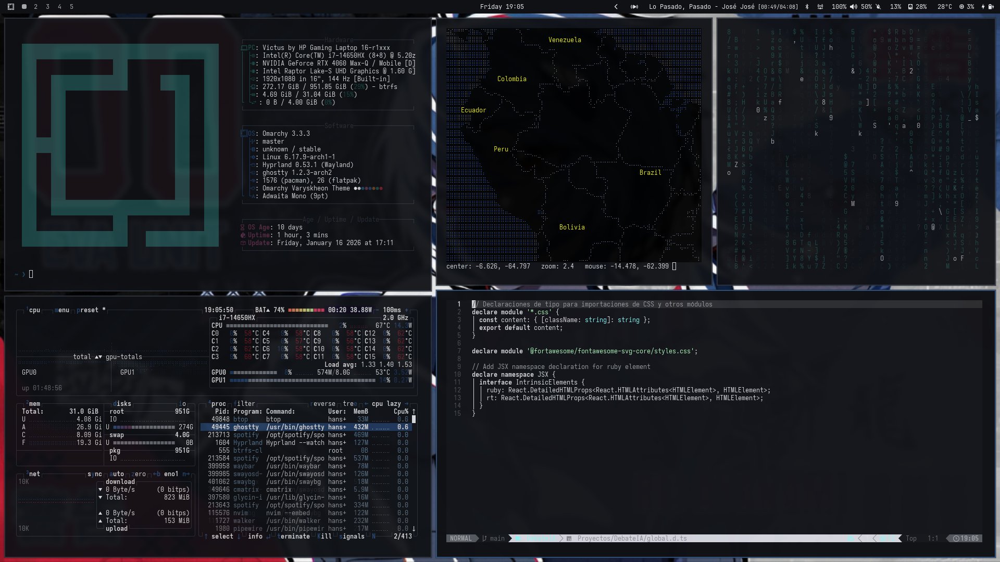

# Varyskheon
> Professional dark theme for Omarchy | Hyprland systems

**Varyskheon** is a professional dark theme with academic-tech aesthetic, featuring a sophisticated balance of deep neutrals (50%), cold structural blue (25%), and warm industrial red (25%). Designed for high contrast without visual fatigue.



## Color Philosophy

- **50% Deep Neutrals**: Carbon black, deep greys for structure
- **25% Cold Blue**: Structural elements, control, focus states
- **25% Warm Industrial Red**: Emphasis, decisions, critical states
- High contrast text without eye strain
- No neon, no pastels - pure professional aesthetic

## Installation

This theme can be installed two ways to your Omarchy system. Choose one.

### TERMINAL
```bash
omarchy-theme-install https://github.com/YOUR_USERNAME/varyskheon.git
```

### WALKER MENU
1. Copy this link: `https://github.com/YOUR_USERNAME/varyskheon.git`
2. Open Walker: `SUPER+ALT+SPACE`, navigate to: Install < Style < Theme
3. Paste: `CTRL+SHIFT+V`, then press enter/return

## Features

### System Modifications
- **Background**: Deep carbon black (#0f1115)
- **Foreground**: Clear white (#e6e8eb)
- **Accent**: Cold structural blue (#2b4f7c)
- **Critical**: Industrial red (#a8323e)

### Supported Applications
- **Terminals**: Alacritty, Kitty, Ghostty
- **System Monitors**: btop++, nvtop
- **Notifications**: Mako
- **Window Manager**: Hyprland (borders, groups, focus states)
- **Bar**: Waybar
- **Icons**: Yaru-dark

### Theme Components
- `colors.toml` - Central color palette (ANSI colors)
- `hyprland.conf` - Window manager configuration
- `waybar.css` - Status bar styling
- `btop.theme` - System monitor theme
- `mako.ini` - Notification daemon styling
- `alacritty.toml` - Alacritty terminal colors
- `kitty.conf` - Kitty terminal colors
- `ghostty.conf` - Ghostty terminal colors
- `icons.theme` - Icon theme selection

## Color Palette

### Primary Colors
```
Background:     #0f1115  (Deep carbon)
Foreground:     #e6e8eb  (Clear white)
Accent:         #2b4f7c  (Cold blue)
Border:         #2a2f3a  (Neutral grey)
```

### Semantic Colors
```
Critical:       #a8323e  (Industrial red)
Warning:        #8a5a2d  (Dark amber)
Success:        #2d6a6a  (Dark teal)
Info:           #2b4f7c  (Structural blue)
```

## Technical Notes

- All color values are hardcoded for reliability
- No gradients or animations
- Optimized for OLED displays
- Subtle window opacity (0.96/0.94) for terminals
- High contrast ratios for accessibility
- Consistent across all supported applications

## Enhancement Tools

### Aether App
For enhanced theming customization:
```bash
yay -S aether
```
- https://github.com/bjarneo/aether

### Omarchy Theme Hook
For automatic theming of additional applications:
- https://github.com/imbypass/omarchy-theme-hook

## License

MIT License - See LICENSE file for details

## Credits

Created for professional Linux environments running Omarchy/Arch Linux with Hyprland.
